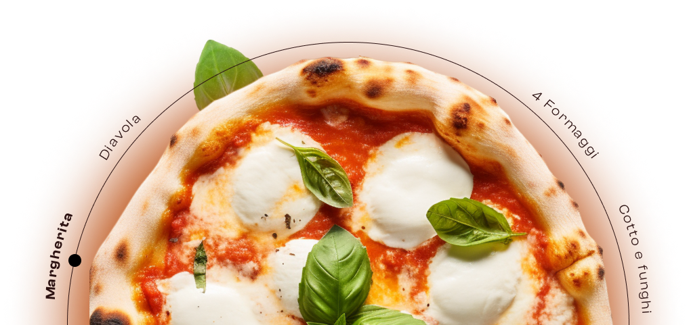

### *Projesso pessoal de uma pizzaria.* 

---
* Linguagem usadas: (HTML, CSS e JAVASCRIPT)

---

#### Descrição do navegador do site:
1. Ao acessar a página inicial, os usuários são recebidos por uma interface visualmente agradável, destacando uma pizza.
2. No canto superior direito, encontra-se o ícone de menu hamburguer, redirecionando os usuários para a segunda tela, onde são apresentadas as opções de pizzas.
3. Na segunda tela, os usuários têm a liberdade de escolher entre os diversos sabores de pizzas disponíveis
4. Após a seleção, um modal é acionado, apresentando opções de tamanho e descrição. Uma barra lateral exibe as pizzas escolhidas.
5.A barra lateral exibe as pizzas selecionadas, seus tamanhos e eventuais com desconto aplicado.
6. Abaixo, encontra-se o botão "Finalizar Pedido".
7.  Observação: O botão é meramente ilustrativo e não possui funcionalidade. Este projeto foi elaborado com o propósito de demonstrar meu aprendizado em HTML, CSS e JS.

#### La pizza populare
- Este projeto é um reflexo do meu progresso no aprendizado dessas tecnologias e tem como objetivo evidenciar minhas habilidades em desenvolvimento web.

- Agradeço imensamente por visitar meu repositório. Para conferir o projeto, por favor, visite o link abaixo.
#### [Link do projeto]( https://werik-alves.github.io/Pizzaria/)

---

